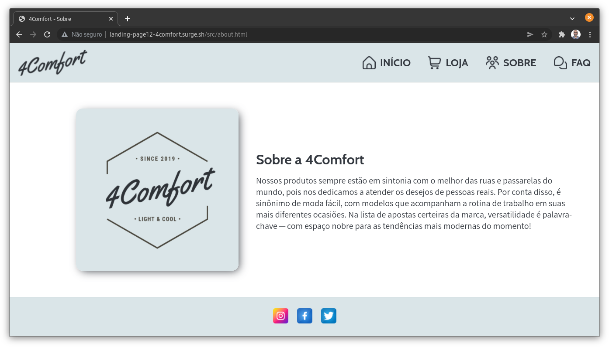

# Projeto de Fixação: Landing Page

### Resumo
Neste projeto foi desenvolvido um site estático para a 4Comfort ─ empresa do ramo de calçados com vendas online. O site possui quatro páginas cobrindo a apresentação inicial da empresa (Início), a estande para exibir os produtos (Loja), a seção com mais detalhes sobre a empresa (Sobre) e as perguntas frequentes (FAQ). A construção do site buscou tratar com zelo às questões de acessibilidade, sendo que o HTML está estruturado seguindos os padrões e diretrizes do emprego adequado de tags semânticas. Além disso, a responsividade do site foi pensada utilizando o conceito de mobile first, estando implementa em uma versão para mobile e outra para desktop. Por fim, a paleta de cores foi pensada a partir do logotipo da impresa, compondo um conjunto de cores próximas do [Nord Theme](https://www.nordtheme.com/) e que buscam representar a identidade leve e moderna da marca possui.

### Implementações Futuras
É necessário ainda integrar ao site as funcionalidade do back-end para o funcionamento do sistema e-commerce.

### Integrantes
- [Douglas Joziel Bitencourt Freitas](https://github.com/douglas-joziel)
- [Guilherme Arruda Câmara de Lira](https://github.com/Guilhermearrud)
- [Fabio Matheus Brito Ferreira](https://github.com/FabioMatheus777)

### Objetivo Geral
O objetivo geral deste projeto é desenvolver o site de uma empresa fictícia chamada de 4Comfort ─ a empresa atua no ramo de calçados (tênis) com vendas online dos seus produtos.

### Objetivos Específicos
1. Desenvolver a habilidade trabalho remoto em equipe;
2. Consolidar os conhecimentos de HTML, CSS e JS;
3. Gerenciar ocasionais conflitos no repositório do GitHub;
4. Conteplar os requisitos propostos no [enunciado do projeto](https://labenu.notion.site/Projeto-de-Fixa-o-Landing-Page-e46f233c072e49d69950cfa49cd29e13).

### Link Surge
- (Update 18/03/2022) [4comfort.surge.sh](http://landing-page12-4comfort.surge.sh/)

### Imagens

